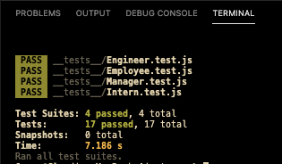

# Team Profile Generator

### Website: 
https://jarellano562.github.io/teams/
   
## Description

A Node.js command-line application that takes in information about employees on a software engineering team and generates an HTML webpage that displays summaries for each person. Unit tests were used for each part of the code to ensure it passes.   

  
The full movie file showing functionality of the application can be found [HERE](https://drive.google.com/file/d/1P-VmZhPipH35ebCaTcOsqUibLdhzSxx1/view?usp=sharing)  
  
## User Story
  
```
AS A manager
I WANT to generate a webpage that displays my team's basic info
SO THAT I have quick access to their emails and GitHub profiles
```
  
## Acceptance Criteria
  
``` 
GIVEN a command-line application that accepts user input
WHEN I am prompted for my team members and their information
THEN an HTML file is generated that displays a nicely formatted team roster based on user input
WHEN I click on an email address in the HTML
THEN my default email program opens and populates the TO field of the email with the address
WHEN I click on the GitHub username
THEN that GitHub profile opens in a new tab
WHEN I start the application
THEN I am prompted to enter the team manager’s name, employee id, email address, and office number
WHEN I enter the team manager’s name, employee id, email address, and office number
THEN I am presented with a menu with the option to add an engineer, an intern, or finish building my team
WHEN I select the engineer option
THEN I am prompted to enter the engineer’s name, id, email, and GitHub username and I am taken back to the menu
WHEN I select the intern option
THEN I am prompted to enter the intern’s name, id, email, and school and I am taken back to the menu
WHEN I decide to finish building my team
THEN I exit the application and the HTML is generated
```

## Mock-Up
The follwoing image shows the web application's appearance and functionality 


## Table of Contents
- [Website](#website)
- [Description](#description)
- [User Story](#user-story)
- [Acceptance Criteria](#acceptance-criteria)
- [Mock-Up](#mock-up)
- [Table of Contents](#table-of-contents)
- [Installation](#installation)
- [Usage](#usage)
- [Testing](#testing)

## Installation  
  
`npm init`
  
`npm install inquirer`

`npm install email-validator`

`npm install jest`
  
## Usage  
  
Run the following command at the root of your project and answer the prompted questions:
  
`node Index`

## Testing

Testing is done with jest and contains testing for all four Classes: `Employee`, `Manager`, `Engineer` and `Intern`.

`npm install jest`



